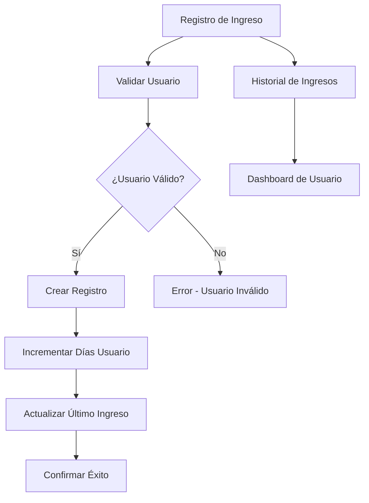

# Sistema de Registro de Ingresos para Gimnasio

## 1. Product Overview
Sistema backend para registrar y gestionar los ingresos de usuarios al gimnasio, permitiendo el seguimiento de asistencias y días acumulados.
- Soluciona la necesidad de controlar el acceso y asistencia de los miembros del gimnasio de manera automatizada.
- Los administradores y el sistema pueden registrar cuando un usuario ingresa al gimnasio y mantener un historial completo.
- Proporciona métricas de asistencia y control de acceso para mejorar la gestión del gimnasio.

## 2. Core Features

### 2.1 User Roles
| Role | Registration Method | Core Permissions |
|------|---------------------|------------------|
| Admin | Sistema existente | Puede registrar ingresos de cualquier usuario, ver historial completo |
| Usuario | Sistema existente | Puede ver su propio historial de ingresos |

### 2.2 Feature Module
Nuestro sistema de registro de ingresos consiste en las siguientes páginas principales:
1. **Registro de Ingreso**: formulario para registrar entrada de usuario, validación de usuario activo.
2. **Historial de Ingresos**: lista de todos los ingresos registrados, filtros por usuario y fecha.
3. **Dashboard de Usuario**: vista del usuario con sus días acumulados, último ingreso registrado.

### 2.3 Page Details
| Page Name | Module Name | Feature description |
|-----------|-------------|---------------------|
| Registro de Ingreso | Formulario de Check-in | Registrar ingreso por ID de usuario, validar usuario activo, confirmar entrada exitosa |
| Registro de Ingreso | Procesamiento Backend | Crear registro en colección ingresos, sumar 1 día al contador del usuario, actualizar último ingreso |
| Historial de Ingresos | Lista de Ingresos | Mostrar todos los ingresos con paginación, filtrar por usuario y rango de fechas |
| Historial de Ingresos | Detalles de Ingreso | Ver información completa del ingreso, fecha, hora, usuario |
| Dashboard de Usuario | Estadísticas Personales | Mostrar días acumulados totales, fecha del último ingreso, resumen de asistencia |

## 3. Core Process

### Flujo Principal de Registro de Ingreso:
1. Usuario o admin accede al sistema de registro
2. Se ingresa el ID del usuario que quiere entrar
3. Sistema valida que el usuario existe y está activo
4. Si es válido, se registra el ingreso en la colección
5. Se incrementa en 1 el contador de días del usuario
6. Se actualiza la fecha del último ingreso
7. Se confirma el registro exitoso

### Flujo de Consulta de Historial:
1. Usuario/admin accede al historial
2. Sistema muestra lista paginada de ingresos
3. Se pueden aplicar filtros por usuario o fecha
4. Se puede ver detalle de cada ingreso

## 4. User Interface Design

### 4.1 Design Style
- Colores primarios: #2563eb (azul), #10b981 (verde para éxito)
- Colores secundarios: #6b7280 (gris), #ef4444 (rojo para errores)
- Botones: estilo redondeado con sombras suaves
- Fuente: Inter, tamaños 14px-16px para texto, 18px-24px para títulos
- Layout: diseño limpio tipo tarjetas con navegación superior
- Iconos: estilo outline, uso de emojis para estados (✅ éxito, ❌ error)

### 4.2 Page Design Overview
| Page Name | Module Name | UI Elements |
|-----------|-------------|-------------|
| Registro de Ingreso | Formulario de Check-in | Input field centrado para ID usuario, botón grande "Registrar Ingreso" verde, feedback visual inmediato |
| Registro de Ingreso | Confirmación | Modal o alert verde con checkmark, mensaje "Ingreso registrado exitosamente", información del usuario |
| Historial de Ingresos | Lista | Tabla responsive con columnas: Usuario, Fecha, Hora, filtros en header, paginación inferior |
| Dashboard de Usuario | Estadísticas | Cards con métricas: "Días Totales", "Último Ingreso", gráfico simple de asistencia mensual |

### 4.3 Responsiveness
Diseño mobile-first con adaptación a desktop, optimizado para tablets usadas en recepción del gimnasio, soporte para touch en dispositivos móviles.